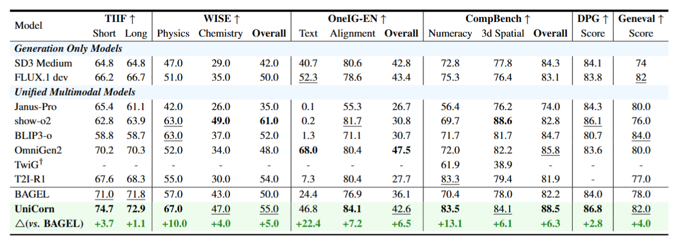

<p align="center">
  
</p>


# UniCorn: Towards Self-Improving Unified Multimodal Models through Self-Generated Supervision
> Ruiyan Han*, [Zhen Fang*](https://costaliya.github.io/), Xinyu Sun*, Yuchen Ma, Ziheng Wang, [Yu Zeng](https://scholar.google.com/citations?user=XJmAr8EAAAAJ&hl=en&oi=sra), [Zehui Chen](https://lovesnowbest.site/), [Lin Chen](https://lin-chen.site/), Wenxuan Huang, Wei-Jie Xu, Yi Cao, and Feng Zhao
>
[](https://arxiv.org/pdf/2601.03193v1)
[](https://github.com/shierlouz/Unicycle)
[](https://huggingface.co/CostaliyA/UniCorn)
[](https://costaliya.github.io/UniCorn.github.io//)
> contact: fazii@mail.ustc.edu.cn
> 
> While Unified Multimodal Models (UMMs) have achieved remarkable success in cross-modal comprehension, a significant gap persists in their ability to leverage such internal knowledge for high-quality generation. We formalize this discrepancy as Conduction Aphasia, a phenomenon where models accurately interpret multimodal inputs but struggle to translate that understanding into faithful and controllable synthesis. To address this, we propose **UniCorn**, a simple yet elegant self-improvement framework that eliminates the need for external data or teacher supervision. By partitioning a single UMM into three collaborative roles: Proposer, Solver, and Judge, UniCorn generates high-quality interactions via self-play and employs cognitive pattern reconstruction to distill latent understanding into explicit generative signals. To validate the restoration of multimodal coherence, we introduce UniCycle, a cycle-consistency benchmark based on a Text to Image to Text reconstruction loop. Extensive experiments demonstrate that UniCorn achieves comprehensive and substantial improvements over the base model across six general image generation benchmarks. Notably, it achieves SOTA performance on TIIF(73.8), DPG(86.8), CompBench(88.5), and UniCycle while further delivering substantial gains of +5.0 on WISE and +6.5 on OneIG. These results highlight that our method significantly enhances T2I generation while maintaining robust comprehension, demonstrating the scalability of fully self-supervised refinement for unified multimodal intelligence.

<!-- ## 🧠 Method
BAGEL adopts a Mixture-of-Transformer-Experts (MoT) architecture to maximize the model’s capacity to learn from richly diverse multimodal information. Following the same principle of capacity maximization, it utilizes two separate encoders to capture pixel-level and semantic-level features of an image. The overall framework follows a Next Group of Token Prediction paradigm, where the model is trained to predict the next group of language or visual tokens as a compression target.

BAGEL scales MoT’s capacity through Pre-training, Continued Training, and Supervised Finetuning on trillions of interleaved multimodal tokens spanning language, image, video, and web data. It surpasses open models on standard understanding and generation benchmarks and demonstrates advanced in-context multimodal abilities like free-form image editing, future frame prediction, 3D manipulation, world navigation, and sequential reasoning.

<p align="center"></p>


## 🌱 Emerging Properties
<p align="center"></p>

As we scale up BAGEL’s pretraining with more multimodal tokens, we observe consistent performance gains across understanding, generation, and editing tasks. Different capabilities emerge at distinct training stages—multimodal understanding and generation appear early, followed by basic editing, while complex, intelligent editing emerges later. This staged progression suggests an emergent pattern, where advanced multimodal reasoning builds on well-formed foundational skills. Ablation studies further show that combining VAE and ViT features significantly improves intelligent editing, underscoring the importance of visual-semantic context in enabling complex multimodal reasoning and further supporting its role in the emergence of advanced capabilities. -->

## 📢 News

We sincerely thank all contributors from the open community for their valuable support.

- **Jan. 7, 2026:** We released the official [report](https://arxiv.org/pdf/2601.03193) for UniCorn. 
<!-- And please upvote for our [huggingface daily paper](https://huggingface.co/papers/2510.12784) as well as try the [demo](https://huggingface.co/spaces/Wayne-King/SRUM_Bagel_MoT-7B) -->


## 📝 To-Do List

This list tracks the progress of our open-source development and model optimization:


- [ ] Release the code.

- [ ] Release the ckpt.

We appreciate the support from our contributors and the open-source community.


## 📮 Notice
<!-- **Call for Bad Cases:** If you have encountered any cases where the model performs poorly, we would greatly appreciate it if you could share them in the [issue#11](https://github.com/ByteDance-Seed/Bagel/issues/11) or [Discord](https://discord.gg/Z836xxzy). -->
Follow the Bagel's original settings, you should focus:

**About Inference Hyperparameters:**
- **`cfg_text_scale`:** Controls how strongly the model follows the text prompt. `1.0` disables text guidance. Typical range: `4.0–8.0`.
- **`cfg_image_scale`:** Controls how much the model preserves input image details. `1.0` disables image guidance. Typical range: `1.0–2.0`.
- **`cfg_interval`:** Fraction of denoising steps where CFG is applied. Later steps can skip CFG to reduce computation. Typical: `[0.4, 1.0]`.
- **`timestep_shift`:** Shifts the distribution of denoising steps. Higher values allocate more steps at the start (affects layout); lower values allocate more at the end (improves details).
- **`num_timesteps`:** Total denoising steps. Typical: `50`.
- **`cfg_renorm_min`:** Minimum value for CFG-Renorm. `1.0` disables renorm. Typical: `0`.
- **`cfg_renorm_type`:** CFG-Renorm method:  
  - `global`: Normalize over all tokens and channels (default for T2I).
  - `channel`: Normalize across channels for each token.
  - `text_channel`: Like `channel`, but only applies to text condition (good for editing, may cause blur).
- **If edited images appear blurry, try `global` CFG-Renorm, decrease `cfg_renorm_min` or decrease `cfg_scale`.**


## 📊 Benchmarks

<p align="center">
  
</p>


  
 
</p>


### 🎨 Visualization
<p align="center">
  
</p>


## 🙏 Acknowledgments

This project is built upon several excellent open-source projects: [BAGEL](https://github.com/jerryjliu/llama_index), [IRG](https://github.com/Osilly/Interleaving-Reasoning-Generation) and [SRUM](https://github.com/WayneJin0918/SRUM). We sincerely thank the authors for their contributions:

We are grateful to the broader research community for their open-source spirit and collaborative efforts.


## ✍️ Citation

```bibtex
@article{han2026unicorn,
      title={UniCorn: Towards Self-Improving Unified Multimodal Models through Self-Generated Supervision}, 
      author={Han, Ruiyan and Fang, Zhen and Sun, XinYu and Ma, Yuchen and Wang, Ziheng and Zeng, Yu and Chen, Zehui and Chen, Lin and Huang, Wenxuan and Xu, Wei-Jie and others},
      journal={arXiv preprint arXiv:2601.03193},
      year={2026},
}
```

## 📜 License
UniCorn is licensed under the Apache 2.0.
